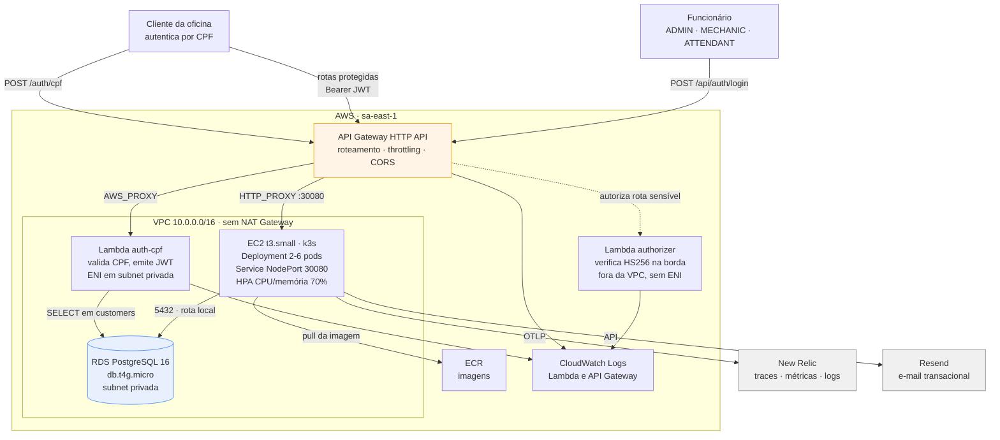
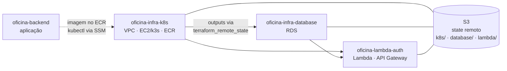
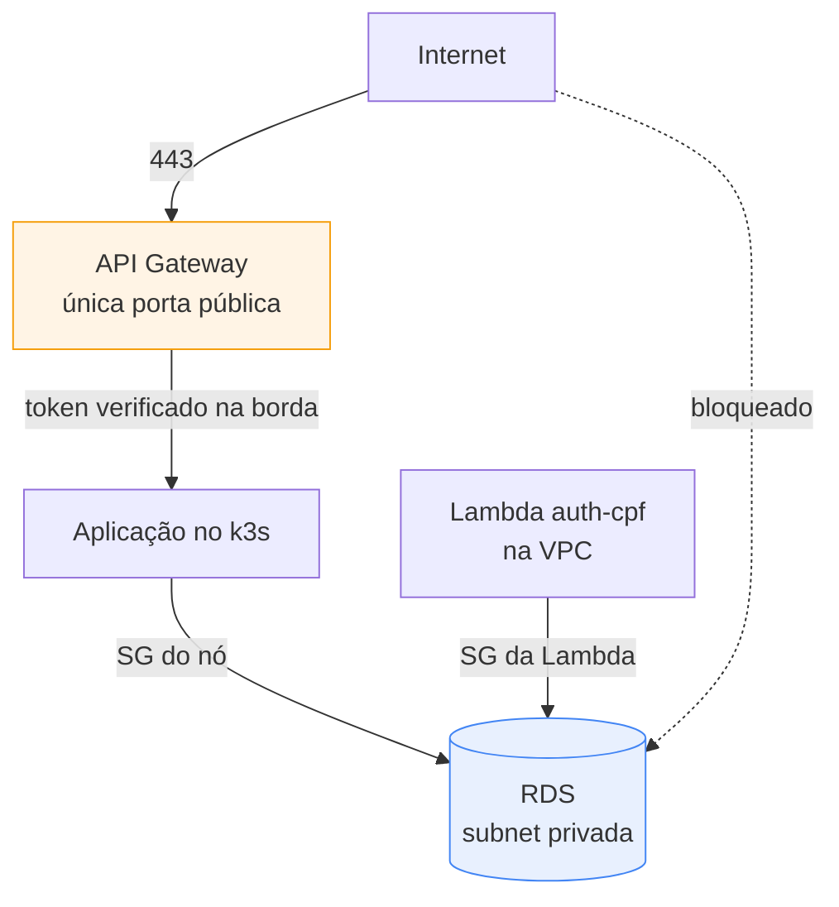

# Diagrama de Componentes

Visão de nuvem do sistema: entrada pública, computação, dados e observabilidade.

---

## Visão geral

O caminho de entrega (GitHub Actions publicando imagem no ECR, aplicando manifestos por SSM e gravando state no S3) está separado mais abaixo, em [Entrega](#entrega), para não sobrecarregar este diagrama.

---

## Componentes

### Entrada

| Componente | Responsabilidade |
|---|---|
| **API Gateway (HTTP API)** | Única porta de entrada pública. Roteia, aplica throttling (50 req/s, burst 100), CORS e registra log de acesso em JSON |
| **Lambda `authorizer`** | Verifica a assinatura HS256 do token nas rotas sensíveis, **antes** de a requisição chegar ao cluster. Decisão cacheada 5 min por token |

Rotas abertas: `POST /auth/cpf`, `/api/health/*`, `/api/docs/*` e `/api/auth/*`. Todo o resto exige token válido na borda. No HTTP API a rota mais específica vence a mais genérica.

### Autenticação

Dois caminhos, dois públicos:

| Quem | Como | Emitido por |
|---|---|---|
| **Cliente da oficina** | CPF, sem senha | Lambda `auth-cpf` |
| **Funcionário** | e-mail + senha, com papel | Aplicação (`POST /api/auth/login`) |

Ambos produzem JWT HS256 assinado com o **mesmo segredo**, e a aplicação valida os dois com o mesmo `JwtStrategy`. É isso que permite a Lambda existir sem duplicar a lógica de autorização da API.

### Computação

| Componente | Responsabilidade |
|---|---|
| **k3s numa EC2 `t3.small`** | Kubernetes conformante em nó único. Escolha de custo — ver [ADR-001](../adr/adr-001-k3s-em-ec2-no-lugar-do-eks.md) |
| **Deployment** | 2 a 6 réplicas, com probes de liveness e readiness |
| **HPA** | Escala por CPU e memória a 70% — ver [ADR-002](../adr/adr-002-hpa-para-escalabilidade.md) |
| **Service NodePort 30080** | k3s puro não provisiona Load Balancer da AWS; o API Gateway fala direto com o IP elástico do nó |

### Dados

**RDS PostgreSQL 16** em subnet privada, sem acesso público. O security group libera a porta 5432 apenas para dois security groups: o do nó k3s e o da Lambda de autenticação.

Justificativa da escolha em [RFC-002](../rfc/rfc-002-escolha-do-banco-de-dados.md); modelo e relacionamentos em [modelagem-de-dados.md](../modelagem-de-dados.md).

### Observabilidade

| Origem | Sinal | Destino |
|---|---|---|
| Aplicação | Traces, métricas e logs, via OpenTelemetry | New Relic (OTLP) |
| Lambdas | Log estruturado em JSON | CloudWatch Logs |
| API Gateway | Log de acesso em JSON, com latência e `requestId` | CloudWatch Logs |
| Cluster | CPU e memória dos pods | New Relic (integração Kubernetes) |

OpenTelemetry é padrão aberto, então trocar de fornecedor é mudar duas variáveis de ambiente — ver [ADR-007](../adr/adr-007-opentelemetry-no-lugar-de-agente-proprietario.md). Detalhes e consultas prontas em [observabilidade.md](../observabilidade.md).

### Entrega

Quatro repositórios, quatro pipelines, um bucket de state compartilhado:

**Ordem de apply:** `k8s` → `database` → `lambda`.
**Ordem de destroy:** exatamente a inversa — a Lambda cria uma regra no security group do RDS, e o RDS vive na rede do primeiro.

O acoplamento entre repositórios de IaC está registrado em [ADR-005](../adr/adr-005-terraform-state-compartilhado.md).

---

## Fronteiras de segurança

- O banco **não** tem endereço público. Só os dois security groups nomeados alcançam a porta 5432.
- O acesso ao nó é por **AWS Systems Manager**, sem chave SSH e sem porta 22 aberta.
- Segredos do cluster vivem em `Secret` do Kubernetes; os da Lambda, em variável de ambiente criptografada com KMS — ver [ADR-004](../adr/adr-004-segredos-em-variavel-de-ambiente-na-lambda.md).
- Senha, token, CPF e documento são censurados nos logs antes de saírem do cluster.

### Limitação conhecida

O `Service` é `NodePort` num nó com IP elástico público, então a porta **30080 é alcançável pela internet**, contornando o API Gateway. Num desenho de produção isso se resolve com o security group do nó aceitando tráfego apenas dos ranges do API Gateway, ou com um Network Load Balancer interno. Está documentado aqui por ser uma consequência direta da escolha de custo do [ADR-001](../adr/adr-001-k3s-em-ec2-no-lugar-do-eks.md), e não um descuido.
