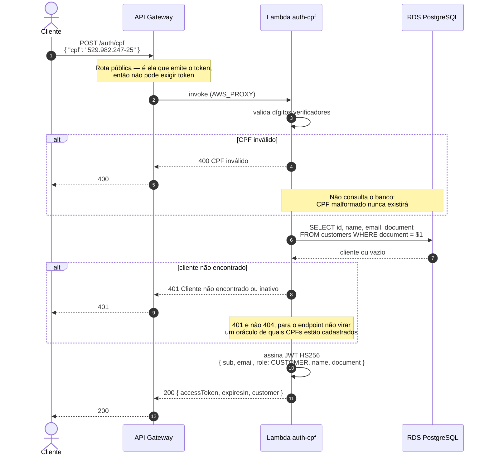
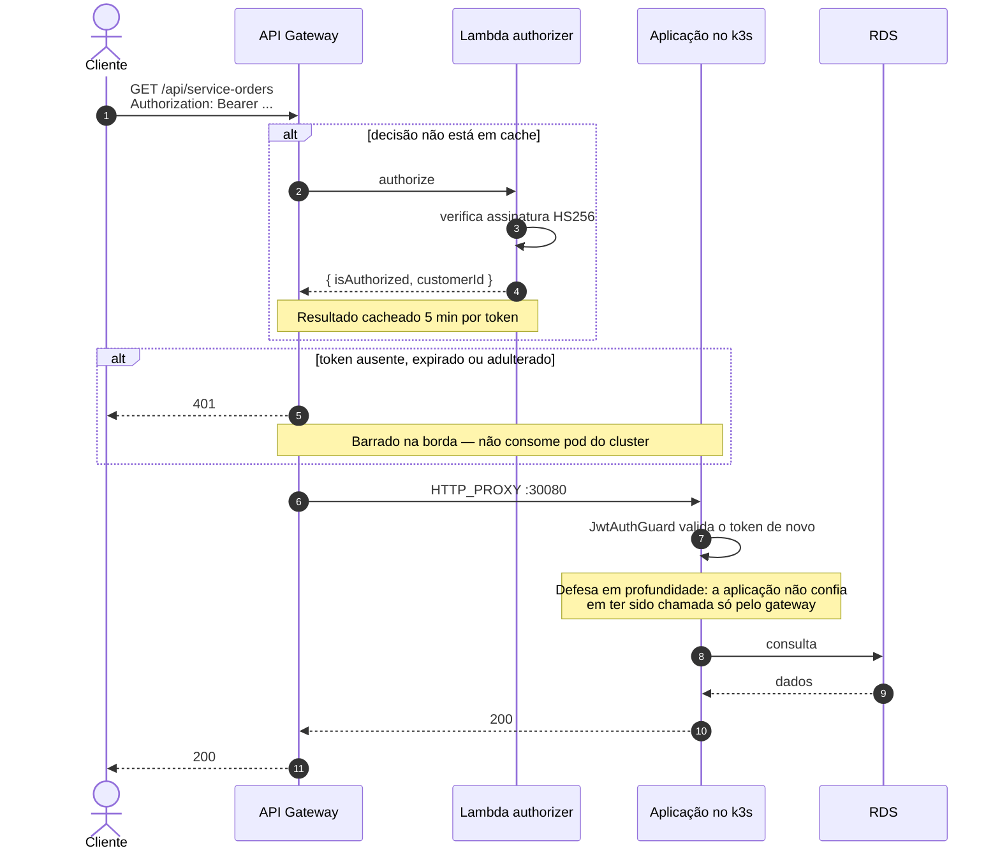
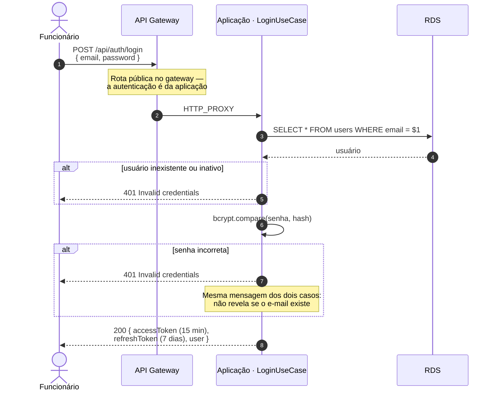
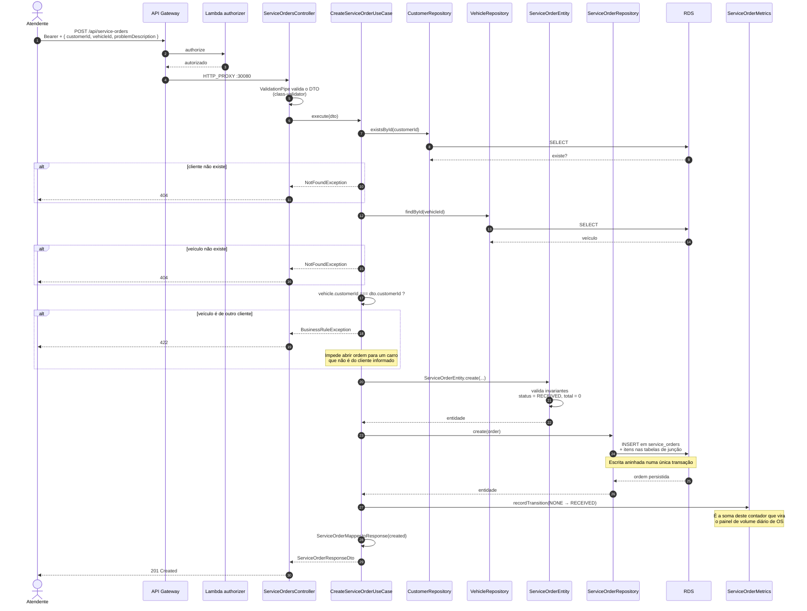
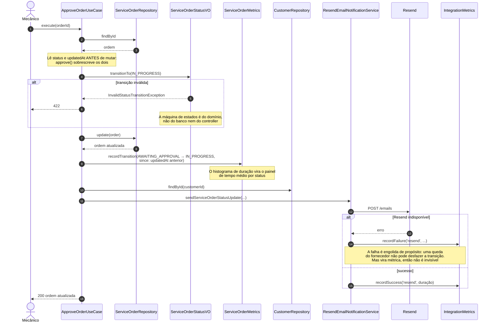
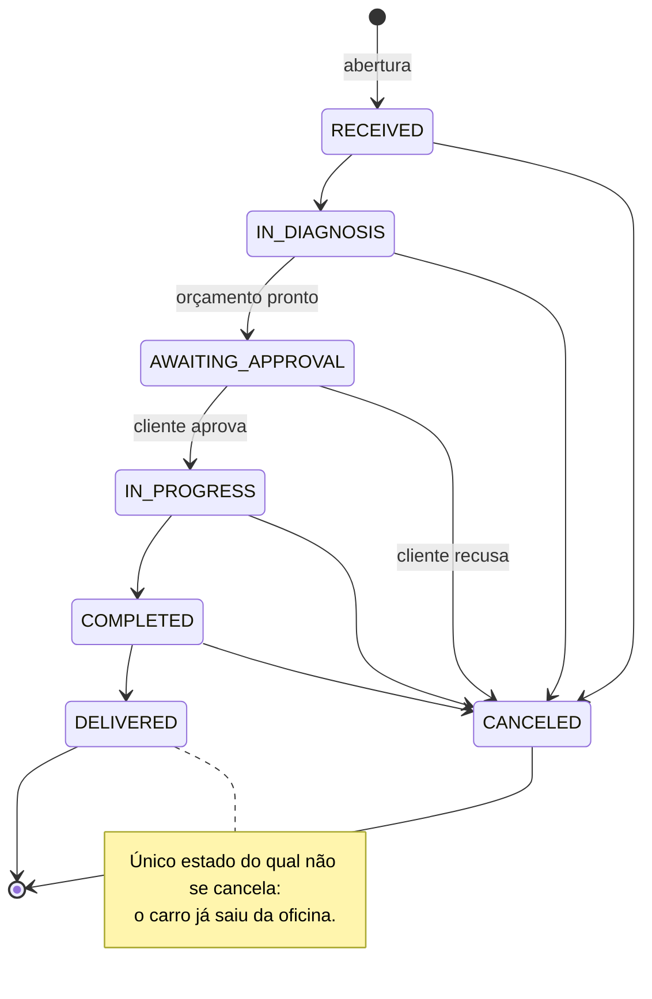

# Diagramas de Sequência

Os dois fluxos exigidos pela Fase 3: **autenticação** e **abertura de ordem de serviço**.

---

## 1. Autenticação do cliente por CPF

O cliente da oficina não tem usuário e senha — tem CPF. Uma função serverless valida o documento, confirma que o cliente existe na base e emite um JWT que a API principal aceita.

O payload carrega `sub`, `email` e `role` porque é o que o `JwtStrategy` da aplicação exige. Manter esses três campos é o que faz o token emitido pela Lambda ser aceito pela API **sem nenhuma alteração do lado dela**.

### Consumo de rota protegida

A validação acontece duas vezes de propósito. A porta 30080 é alcançável diretamente pelo IP do nó (consequência do `NodePort`, ver o diagrama de componentes), então a aplicação não pode assumir que todo tráfego passou pelo gateway.

### Autenticação do funcionário

Caminho separado, para outro público — funcionário tem senha e papel.

Os dois tokens são assinados com o mesmo `JWT_SECRET` compartilhado entre Lambda e aplicação. O segredo é gerado pelo Terraform do repositório da Lambda e precisa estar no `Secret` do Kubernetes — ver [RFC-003](../rfc/rfc-003-estrategia-de-autenticacao.md).

---

## 2. Abertura de ordem de serviço

### Exceção → HTTP

O `HttpExceptionFilter` global traduz as exceções de domínio:

| Exceção | Status |
|---|---|
| `NotFoundException` | 404 |
| `ConflictException` | 409 |
| `BusinessRuleException` | 422 |
| `InvalidStatusTransitionException` | 422 |

O caso de uso nunca conhece HTTP — lança exceção de domínio, e a tradução acontece numa única camada.

---

## 3. Transição de status, com notificação

Mostra por que a falha de e-mail não derruba a operação.

A ordem importa: **persistir primeiro, notificar depois.** Se fosse o contrário, uma falha ao gravar deixaria o cliente com um e-mail sobre uma mudança que não aconteceu.

---

## Máquina de estados da ordem

Aplicada pelo `ServiceOrderStatusVO`, no domínio.

Itens só podem ser adicionados em `RECEIVED`, `IN_DIAGNOSIS` e `AWAITING_APPROVAL` — depois de aprovado, o orçamento está fechado.
