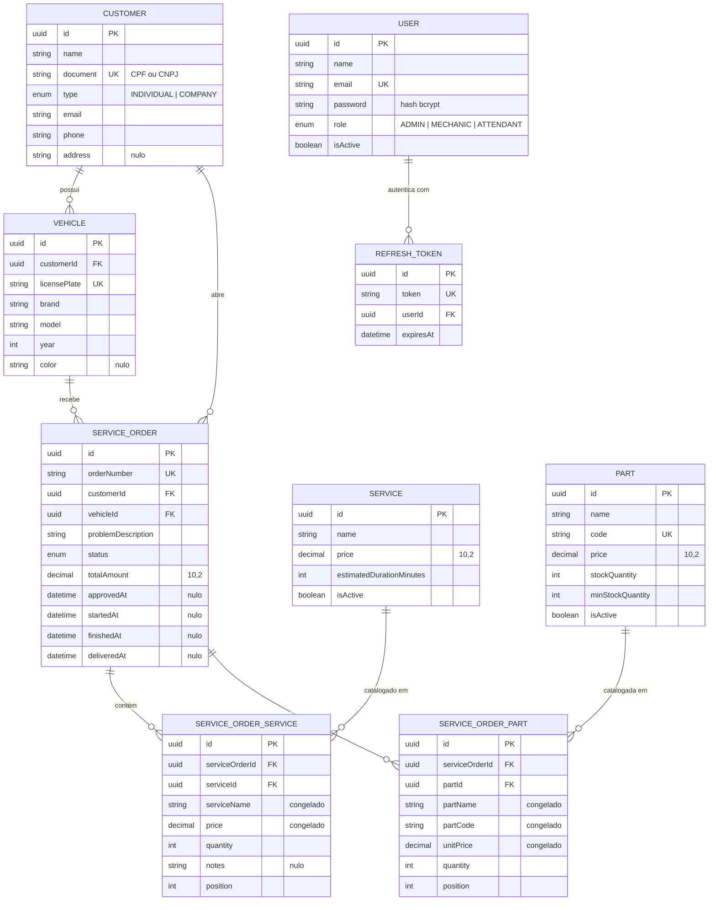

# Modelagem de Dados

Justificativa da escolha do banco, diagrama ER e explicação dos relacionamentos.

---

## Por que um banco relacional, e por que PostgreSQL

O domínio da oficina é relacional por natureza: um cliente tem veículos, um veículo tem ordens de serviço, uma ordem tem itens que vêm de um catálogo. Essas ligações são o dado, não um detalhe de implementação.

Mais decisivo que isso é a exigência de **transação**. Aprovar um orçamento, numa única operação indivisível: muda o status da ordem, congela o valor total e baixa o estoque das peças. Se metade acontecer, a oficina fica com estoque errado ou com uma ordem aprovada sem valor. Um banco com garantias ACID resolve isso com uma transação; sem elas, seria preciso reimplementar consistência na aplicação, com muito mais código e menos garantia.

O volume também importa na escolha: uma rede de oficinas gera milhares de ordens por mês, não bilhões de eventos por dia. Não há problema de escala que justifique abrir mão de integridade referencial.

**PostgreSQL** especificamente, entre os relacionais:

| Critério | Peso na decisão |
|---|---|
| Tipo `DECIMAL` exato | Valores monetários não podem usar ponto flutuante. `DECIMAL(10,2)` é usado em todo preço e total do modelo |
| Enums nativos | `ServiceOrderStatus` e `UserRole` viram tipo do banco, não string solta sujeita a erro de digitação |
| RDS gerenciado | Backup automático, patching e métricas sem trabalho operacional, dentro do free tier |
| Suporte do Prisma | Cobertura completa de migrations e tipos, incluindo `DECIMAL` e enums |
| Custo | `db.t4g.micro` coberto pelo free tier de conta nova |

Decisão registrada formalmente na RFC-002.

---

## Diagrama ER



---

## Os relacionamentos, um a um

**Cliente → Veículo (1:N).** Um cliente pode ter vários veículos; um veículo pertence a um cliente. `licensePlate` é única em todo o sistema — a placa identifica o veículo no país inteiro, não só dentro de um cliente.

**Cliente → Ordem de Serviço (1:N)** e **Veículo → Ordem de Serviço (1:N).** A ordem referencia os dois, e não só o veículo, de propósito: é redundante enquanto o veículo não muda de dono, mas quando muda, a ordem histórica precisa continuar apontando para quem de fato pagou por ela.

**Ordem ↔ Serviço e Ordem ↔ Peça (N:N, via tabela de junção).** Uma ordem tem vários serviços e peças; o mesmo serviço aparece em várias ordens. As tabelas `service_order_services` e `service_order_parts` materializam essa relação e carregam os atributos que só existem na combinação: quantidade, observação e o preço praticado.

**Usuário → Refresh Token (1:N), com cascade.** Apagar o usuário apaga os tokens dele; um token órfão é um risco de segurança, não um dado histórico.

---

## A mudança de modelagem da Fase 3

### O problema

Na Fase 2, os itens da ordem eram dois campos `Json`:

```prisma
model ServiceOrder {
  services Json
  parts    Json
}
```

Funcionava para gravar e ler a ordem inteira, e falhava em tudo o mais:

1. **Sem integridade referencial.** Nada impedia gravar um `serviceId` que não existe no catálogo, ou apagar do catálogo um serviço que dezenas de ordens referenciavam. O banco aceitava calado, e o erro só aparecia meses depois, na leitura.
2. **Sem consulta analítica.** "Qual o serviço mais vendido no trimestre?" ou "quantas unidades desta peça saíram?" exigia varrer todas as ordens e desserializar Json na aplicação. Não dá para indexar, agrupar ou somar dentro de um campo Json de forma eficiente.
3. **Sem tipo.** `price` dentro do Json era um número JavaScript — ponto flutuante binário, o oposto do que se usa para dinheiro. Fora do Json, a mesma coluna é `DECIMAL(10,2)`.
4. **Sem restrição.** Nada garantia que `quantity` fosse positivo, que `serviceName` existisse, ou que o formato do objeto não mudasse entre uma gravação e outra.

### A solução

Duas tabelas de junção com chave estrangeira:

```
service_orders ──< service_order_services >── services
               ──< service_order_parts    >── parts
```

Com `ON DELETE CASCADE` no lado da ordem — apagar a ordem leva os itens — e `ON DELETE RESTRICT` no lado do catálogo: **não se apaga um serviço que alguma ordem histórica referencia.** É exatamente a integridade que faltava.

### Por que os preços continuam duplicados na tabela de junção

`serviceName`, `price`, `partName`, `partCode` e `unitPrice` são cópias do catálogo, gravadas no momento em que o item entrou na ordem. Isso parece redundância, e não é: **é um instantâneo deliberado.**

Se a oficina reajustar a troca de óleo de R$ 150 para R$ 180, toda ordem já orçada continua valendo R$ 150. Sem a cópia, o valor de ordens passadas mudaria sozinho sempre que o catálogo mudasse — e o cliente que aprovou um orçamento receberia outra conta.

A chave estrangeira continua existindo para garantir rastreabilidade (de qual item do catálogo isto veio); a cópia garante imutabilidade do que foi acordado.

### Por que `totalPrice` foi removido, mas `totalAmount` ficou

Duas redundâncias aparentemente iguais, tratadas de forma diferente — e a diferença é o ponto:

| Campo | Destino | Motivo |
|---|---|---|
| `ServiceOrderPart.totalPrice` | **Removido** | Era `unitPrice × quantity`, duas colunas **da mesma linha**. Guardar o produto ao lado dos fatores só cria a possibilidade de os três se contradizerem. É calculado na leitura |
| `ServiceOrder.totalAmount` | **Mantido** | É a soma de **duas tabelas filhas**. Recalcular exigiria join com agregação em toda listagem, e é o valor que o cliente aprovou — congelá-lo é o comportamento correto |

A regra: derivação dentro da mesma linha é redundância pura; agregação entre tabelas é um valor com significado próprio.

### A coluna `position`

Preserva a ordem em que os itens foram adicionados. Sem ela, a ordem de leitura do banco é indefinida, e o mesmo pedido retornaria os itens embaralhados entre duas requisições. A restrição `UNIQUE (serviceOrderId, position)` impede duas linhas disputarem a mesma posição.

---

## Índices

O PostgreSQL cria índice automaticamente para chave primária e restrição `UNIQUE`, mas **não para coluna de chave estrangeira**. Todas as FKs do modelo estavam sem índice.

| Tabela | Índice | Consulta que ele atende |
|---|---|---|
| `service_orders` | `customerId` | Listar as ordens de um cliente |
| `service_orders` | `vehicleId` | Histórico de um veículo |
| `service_orders` | `(status, createdAt)` | Listagem principal, que filtra por status e ordena por data |
| `service_orders` | `createdAt` | Relatórios por período |
| `service_order_services` | `serviceOrderId` | Carregar os itens de uma ordem |
| `service_order_services` | `serviceId` | Serviços mais vendidos |
| `service_order_parts` | `serviceOrderId` | Carregar os itens de uma ordem |
| `service_order_parts` | `partId` | Consumo de uma peça |
| `vehicles` | `customerId` | Veículos de um cliente |
| `refresh_tokens` | `userId` | Invalidar sessões de um usuário |
| `refresh_tokens` | `expiresAt` | Limpeza periódica de tokens vencidos |

O índice composto `(status, createdAt)` torna desnecessário um índice só em `status`: o Postgres usa o prefixo mais à esquerda de um índice composto, então ele atende tanto o filtro por status sozinho quanto o filtro com ordenação por data.

---

## A migração

`prisma/migrations/20260914000000_service_order_junction_tables/`

Escrita à mão, porque **preserva os dados existentes**. Uma migração gerada automaticamente teria apagado as colunas `Json` e, com elas, todos os itens de todas as ordens já cadastradas.

A extração usa `jsonb_array_elements ... WITH ORDINALITY`, que devolve cada elemento do array junto com o índice dele — é o índice que vira a coluna `position` e preserva a ordem original.

Sequência: criar as tabelas → copiar os dados → só então remover as colunas `Json` → criar índices e chaves estrangeiras.

`totalAmount` não é recalculado durante a migração, de propósito: é o valor que o cliente aprovou, e recalculá-lo alteraria registro financeiro histórico.

Validada contra um Postgres real com ordens contendo múltiplos itens, notas nulas e arrays vazios, conferindo que a ordem dos itens e os valores sobreviveram intactos.

---

## Testes

`test/integration/service-order.repository.integration-spec.ts` exercita a persistência contra um Postgres de verdade. Escrita e leitura de relação aninhada, ordem dos itens, integridade referencial e cascade são coisas que só o banco decide — teste com repositório mockado não prova nenhuma delas.

Cobre: gravar e reler uma ordem com itens, preservação da ordem, substituição dos itens no update sem deixar órfão, recusa de item apontando para serviço inexistente, cascade ao apagar a ordem, e bloqueio ao apagar serviço do catálogo em uso.
